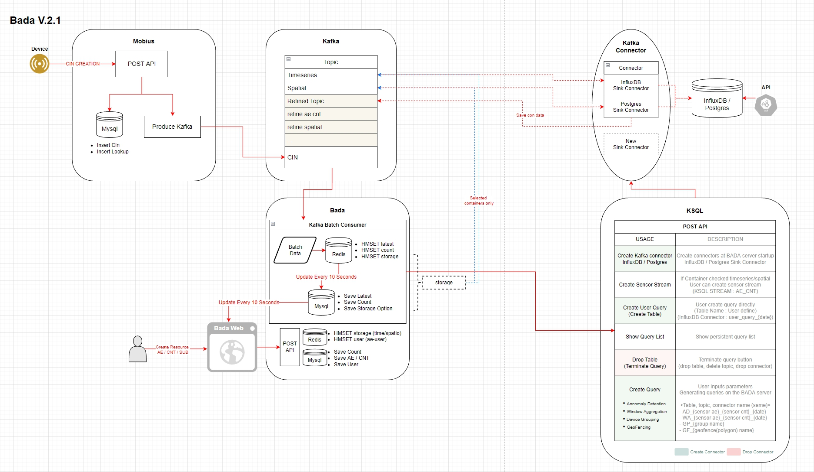

# IoTStreamingPlatformV2
## 시작하기
### 구조도 
 
### 설치
 * Node.js : 14.X (16 빌드 에러)
 * Mysql
 * Mosquitto
 * Redis
 * InfluxDB : 1.8
 * Postgresql
 * Kafka : 3 이하로는 상관없는 듯 함 (2.4 사용)
 * KSQL 

### Config 파일 수정
 * BadaV2/server/configuration/config.json
 * MobiusV2/mobius.js
 * MobiusV2/conf.json

### Kafka Connector 생성 
 * Custom InfluxDB Sink Connector
 * Postgresql Sink Connector
 * InfluxDB Sink Connector
 > Connector 빌드 : mvn clean package -DskipTests

 * Kafka config 파일에 connector 주소 추가
 > kafkaDIR/config/connect-distributed.properties -> plugin.path에 target 주소 추가

    plugin.path=/home/cotlab/data-collection-platform/stream-reactor-1.2.7-2.1.0,/home/cotlab/data-collection-platform/custom-kafka-connect-influxdb/target,/home/cotlab/data-collection-platform/kafka-connect-jdbc/target 

### KSQL 빌드
 * github 주소 : https://github.com/confluentinc/ksql
 * MVN 빌드하여 사용
 * 8088 포트가 influxdb와 겹칠 수도 있어 8090으로 포트 변경 (config/ksql-server.properties)
 * 📁빌드된 파일 업로드 해 놓음

### 실행 순서
  1. Zookeeper - Kafka - Kafka connect 실행
  2. Ksqldb 서버 실행
  3. 기타 데이터베이스 실행
  4. Mobius 실행 (MobiusV2 - node mobius.js)
  5. Bada 실행 (BadaV2 - node bada.js)

## 사용하는 포트

 | Program | Port |
 |:--------|-----:|
 |Bada|7576|
 |Mobius|7579|
 |Mysql|3306|
 |Redis|6379|
 |zookeeper|2181|
 |kafka|9092|
 |kafka connect|8083|
 |influxdb|8086|
 |postgresql|5432|
 |ksql|8090|

 